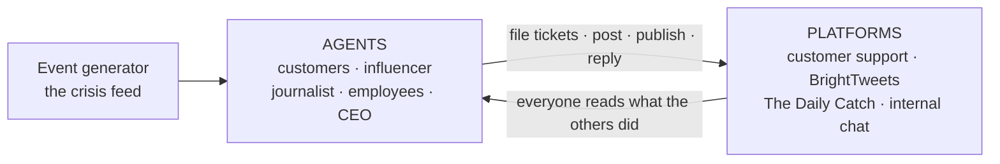

# HappyTuna — a multi-agent crisis simulation

> [!NOTE]
> **`stable-release` branch — every agent runs Claude Haiku.** One provider, one
> key, no dependency on NVIDIA's NIM servers (which are being deprecated on
> 25.08.2026). `main` keeps the original mixed roster: NIM for the customer and
> influencer agents, Gemini for the journalist and CEO.

**HappyTuna** is a fictional canned-tuna company having a food-safety crisis.
LLM agents — customers, an influencer, a journalist, employees, and a CEO — live
on realistic company platforms and react to each other: complaints become
tickets, tickets become posts, posts become news, and the CEO has to manage it.



## Quick start

Prerequisites: Docker Desktop (with Compose).

```bash
cp .env.example .env        # fill in the LLM keys (see below)
docker compose up --build   # first build takes a while (agent images)

curl -X POST "http://localhost:8006/replay?delay=2.0"   # start the crisis
docker compose logs -f customer-agent journalist-agent ceo-agent
```

## Where to look

| URL | What you'll see |
|---|---|
| http://localhost:3005/app/ | **BrightTweets** — complaints, influencer takes, headlines, CEO statements |
| http://localhost:8004 | **The Daily Catch** — the journalism site's live front page |
| http://localhost:5173 | **Support dashboard** — tickets arriving and being handled |
| http://localhost:8003/docs | Customer Support API |
| :8085/health · :8006/health | Internal chat and event generator (no UI) |

## API keys (`.env`)

| Key | Used by | Get one at |
|---|---|---|
| `ANTHROPIC_API_KEY` | **all five agents** + the event generator (`claude-haiku-4-5`) | https://console.anthropic.com |
| `GEMINI_API_KEY` | the journalist's knowledge-base embeddings only | https://aistudio.google.com |

Anthropic has no embeddings API, so the journalist reasons with Haiku but embeds
its RAG knowledge base with Gemini — the one place a second key is needed. A
missing key doesn't break the stack, only the agents that need it, and only when
they try to think.

## The cast

**Platforms** ([`platforms/`](platforms/)) — everything an agent does, it does through one of these:

| Platform | What it is |
|---|---|
| [`customer-support`](platforms/customer-support/) | Ticketing system — REST + MCP + dashboard |
| [`social-network`](platforms/social-network/) | "BrightTweets" — feed UI, REST, and two MCP servers (social + analytics) |
| [`journalism-site`](platforms/journalism-site/) | "The Daily Catch" — news site with a live front page |
| [`internal-chat`](platforms/internal-chat/) | Company messaging — REST + MCP, agents woken by @mentions |

**Agents** ([`agents/`](agents/)):

| Agent | What it does |
|---|---|
| [`customer`](agents/customer/) | 5 personas react to events — file real tickets, post complaints or praise |
| [`influencer`](agents/influencer/) | Polls the feed, then amplifies or criticizes what it sees |
| [`journalist`](agents/journalist/) | Investigates press events against a RAG knowledge base, publishes articles |
| [`employee`](agents/employee/) | 5 personas woken by @mentions and ticket sweeps — reply, escalate, report |
| [`ceo`](agents/ceo/) | Plan-solve loop with sliding-window memory, acting on **all four** platforms through a policy-enforcing MCP gateway |

**Event generator** ([`event-generator/`](event-generator/)) fires the crisis feed
over SSE — scripted (`/replay`, free and deterministic) or LLM-generated.

## Documentation

- [`docs/architecture.md`](docs/architecture.md) — the whole world on one page: diagrams, contracts, and how to run it
- [`docs/ceo-agent.md`](docs/ceo-agent.md) — the CEO agent in depth (gateway, memory, cycle diagrams)
- [`docs/README.md`](docs/README.md) — index of every document in the repo

Each platform and agent also keeps its own README next to its code.

## Running it

- [Resetting the world](docs/architecture.md#state-what-a-run-starts-from) — what starts fresh each run, what persists
- [When an agent isn't reacting](docs/architecture.md#when-an-agent-isnt-reacting) — usually a model provider, not the agent
- [Keeping LLM costs down](docs/architecture.md#keeping-llm-costs-down) — free replays, dry runs, and the interval knobs
