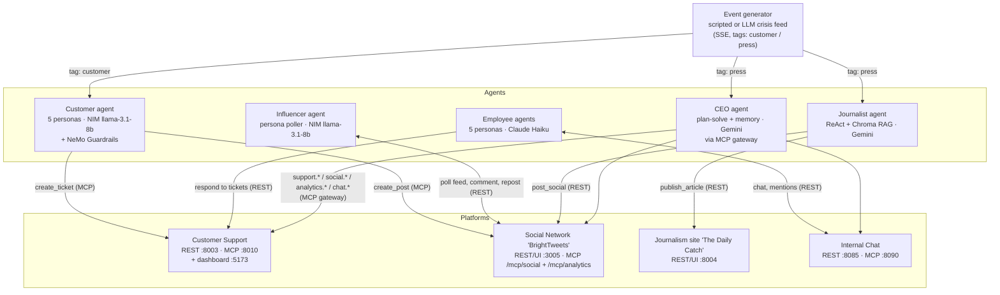

# Architecture

The HappyTuna simulation is a small world: **four platforms** every agent acts
through, **five LLM agents** that live on those platforms, and an **event
generator** that injects the crisis. Agents never talk to each other directly —
everything flows through platform APIs (REST or MCP), exactly like the real
company systems they model.

## The world at a glance

## How a crisis round unfolds

1. The **event generator** fires an event (`POST /replay` plays the scripted
   12-event salmonella arc; `POST /emit` injects one event; `generate()` is the
   LLM mode).
2. **Customer personas** (tag `customer`) react: file real support tickets,
   post complaints or praise on the social network, or quietly stop buying.
3. The **journalist** (tag `press`) investigates against its knowledge base,
   publishes an article on The Daily Catch, and shares the headline on the
   social network.
4. The **influencer** notices new posts on its poll cycle and amplifies or
   criticizes them.
5. The **CEO** (tag `press`, plus periodic reviews) reads the support queue,
   the analytics surface, the public feed and the internal chat — then acts:
   replies to tickets, posts public statements, convenes employees in chat.
6. **Employees** wake when mentioned in chat and on support-queue sweeps,
   report and escalate internally, and address customer complaints.
7. Reactions create new posts and tickets, which feed the next reactions —
   the cascade, not any single script, is the simulation.

## Communication contracts

| Producer → Consumer | Transport | Contract |
|---|---|---|
| Event generator → agents | SSE (`GET /subscribe?tag=`) | `{tag, text, seq, ts}` JSON frames; agents own a copy of `event_client.py` |
| Customer → Customer Support | MCP (streamable-http) | `create_ticket` |
| Customer → Social Network | MCP | `login` (per-session identity) then `create_post` |
| Influencer → Social Network | REST | `/api/auth/login`, feed paging, comments, reposts |
| Journalist → Journalism site | REST | `POST /articles` |
| Journalist → Social Network | REST | login + `POST /api/posts` |
| Employee → Internal Chat | REST | Bearer = agent id; mentions wake personas |
| Employee → Customer Support | REST | `GET /tickets?status=open`, `PATCH /tickets/{id}` |
| CEO → everything | MCP gateway | role-filtered tool surface, identity injected server-side, full audit log (see [ceo-agent.md](ceo-agent.md)) |

## LLM usage (all deliberately small/fast models)

| Component | Provider · model | Used for |
|---|---|---|
| Customer agent | NVIDIA NIM · `meta/llama-3.1-8b-instruct` (via NeMo Guardrails) | persona decisions |
| Influencer agent | NVIDIA NIM · `meta/llama-3.1-8b-instruct` | amplify/criticize/ignore decisions |
| Journalist agent | Gemini · `gemini-2.5-flash-lite` (+ `gemini-embedding-001`) | ReAct loop + RAG embeddings |
| CEO agent | Gemini · `gemini-2.5-flash-lite` | planning, execution, summaries, memory folding |
| Employee agents | Anthropic · `claude-haiku-4-5` | persona ReAct cycles |
| Event generator | NVIDIA NIM · `meta/llama-3.1-8b-instruct` | optional LLM feed mode |
| Social network analytics | Anthropic · `claude-haiku-4-5` | optional AI sentiment (off by default) |

## Isolation rules (inherited from the original research design)

- **No privileged access:** no agent sees another agent's internal state,
  ground truth, or future events — only what the platforms expose.
- **Identity is never an argument:** every platform binds the caller's
  identity at the connection/session layer (Bearer token, MCP session login),
  so a model cannot impersonate another agent by crafting tool arguments.
- **The CEO cannot manufacture its own public** (no ticket creation, no
  analytics controls) — enforced in the gateway's role policy, not just in
  prompts.
