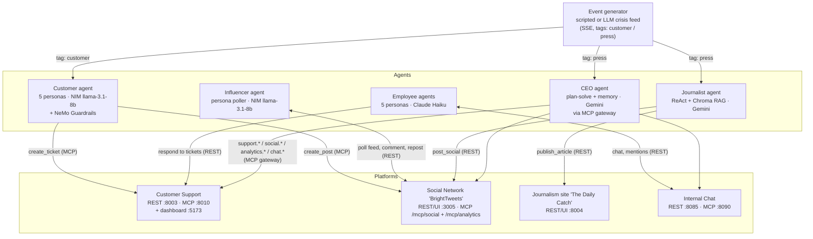

# Architecture

The HappyTuna simulation is a small world: **four platforms** every agent acts
through, **five LLM agents** that live on those platforms, and an **event
generator** that injects the crisis. Agents never talk to each other directly —
everything flows through platform APIs (REST or MCP), exactly like the real
company systems they model.

## The world at a glance



## How a crisis round unfolds

1. The **event generator** fires an event (`POST /replay` plays the scripted
   12-event salmonella arc; `POST /emit` injects one event; `generate()` is the
   LLM mode).
2. **Customer personas** (tag `customer`) react: file real support tickets,
   post complaints or praise on the social network, or quietly stop buying.
3. The **journalist** (tag `press`) investigates against its knowledge base,
   publishes an article on The Daily Catch, and shares the headline on the
   social network.
4. The **influencer** notices new posts on its poll cycle and amplifies or
   criticizes them.
5. The **CEO** (tag `press`, plus periodic reviews) reads the support queue,
   the analytics surface, the public feed and the internal chat — then acts:
   replies to tickets, posts public statements, convenes employees in chat.
6. **Employees** wake when mentioned in chat and on support-queue sweeps,
   report and escalate internally, and address customer complaints.
7. Reactions create new posts and tickets, which feed the next reactions —
   the cascade, not any single script, is the simulation.

## Communication contracts

| Producer → Consumer | Transport | Contract |
|---|---|---|
| Event generator → agents | SSE (`GET /subscribe?tag=`) | `{tag, text, seq, ts}` JSON frames; agents own a copy of `event_client.py` |
| Customer → Customer Support | MCP (streamable-http) | `create_ticket` |
| Customer → Social Network | MCP | `login` (per-session identity) then `create_post` |
| Influencer → Social Network | REST | `/api/auth/login`, feed paging, comments, reposts |
| Journalist → Journalism site | REST | `POST /articles` |
| Journalist → Social Network | REST | login + `POST /api/posts` |
| Employee → Internal Chat | REST | Bearer = agent id; mentions wake personas |
| Employee → Customer Support | REST | `GET /tickets?status=open`, `PATCH /tickets/{id}` |
| CEO → everything | MCP gateway | role-filtered tool surface, identity injected server-side, full audit log (see [ceo-agent.md](ceo-agent.md)) |

## LLM usage (all deliberately small/fast models)

| Component | Provider · model | Used for |
|---|---|---|
| Customer agent | NVIDIA NIM · `meta/llama-3.1-8b-instruct` (via NeMo Guardrails) | persona decisions |
| Influencer agent | NVIDIA NIM · `meta/llama-3.1-8b-instruct` | amplify/criticize/ignore decisions |
| Journalist agent | Gemini · `gemini-2.5-flash-lite` (+ `gemini-embedding-001`) | ReAct loop + RAG embeddings |
| CEO agent | Gemini · `gemini-2.5-flash-lite` | planning, execution, summaries, memory folding |
| Employee agents | Anthropic · `claude-haiku-4-5` | persona ReAct cycles |
| Event generator | NVIDIA NIM · `meta/llama-3.1-8b-instruct` | optional LLM feed mode |
| Social network analytics | Anthropic · `claude-haiku-4-5` | optional AI sentiment (off by default) |

Each agent's provider is swappable without touching its logic: the customer
agent through `CUSTOMER_LLM_*` in `.env` (patched into the guardrails config at
load time), the influencer through `NAT_CONFIG_FILE` (one of three `configs/`
files). This exists because the two NIM agents share a single upstream — when
build.nvidia.com's chat endpoint degrades, both go down together while the
Gemini and Anthropic agents keep running.

## Isolation rules (inherited from the original research design)

- **No privileged access:** no agent sees another agent's internal state,
  ground truth, or future events — only what the platforms expose.
- **Identity is never an argument:** every platform binds the caller's
  identity at the connection/session layer (Bearer token, MCP session login),
  so a model cannot impersonate another agent by crafting tool arguments.
- **The CEO cannot manufacture its own public** (no ticket creation, no
  analytics controls) — enforced in the gateway's role policy, not just in
  prompts.

---

# Running it

## State: what a run starts from

```bash
docker compose down && docker compose up --build   # fresh, empty world
```

| Store | Lives in | Reset by |
|---|---|---|
| Social feed (BrightTweets) | the container's own filesystem | any recreate of `social-network` — every run starts from an empty feed |
| Influencer feed cursors | the container's own filesystem | any recreate — the ids only mean something to one social DB |
| Tickets, articles, chat history, CEO memory | named volumes | `docker compose down -v` |

The public feed is deliberately the volatile one: it is the simulation's visible
output, so a run should start blank and contain only what the agents wrote.
`SEED_DB=true` loads the demo crisis arc instead.

The flip side of that: the feed lives and dies with its container, and
`docker compose up --build <agent>` rebuilds that agent's *dependencies* too —
which recreates the social network and clears the feed mid-run. To restart one
agent without touching the world it lives in:

```bash
docker compose up -d --no-deps --build customer-agent
```

## When an agent isn't reacting

The platforms are plain web services — if a page loads, that half works. Agents
only ever fail for two reasons: they never got the event, or their model
provider didn't answer.

```bash
docker compose logs --tail 30 customer-agent   # one line per persona per event
curl -s localhost:8006/health                  # is the feed alive?
```

**"got no decision: ... the model provider did not answer"** — the provider is
down or throttling you, not the agent. NVIDIA's shared endpoint is the usual
suspect; its signature is a request that hangs ~300s and then returns
`HTTP 504` with `Nvcf-Status: errored`, while `GET /v1/models` still answers
instantly:

```bash
curl -m 60 -X POST https://integrate.api.nvidia.com/v1/chat/completions \
  -H "Authorization: Bearer $NVIDIA_API_KEY" -H "Content-Type: application/json" \
  -d '{"model":"meta/llama-3.1-8b-instruct","messages":[{"role":"user","content":"Say OK"}],"max_tokens":5}'
```

The customer and influencer agents are the two on NIM. To keep demoing while
it's degraded, uncomment the **NIM outage escape hatch** block in `.env` — it
repoints both at Gemini's OpenAI-compatible endpoint with the key you already
have — then:

```bash
docker compose up -d --no-deps customer-agent influencer-agent
```

Comment it back out to return to NIM; nothing else in the project changes.

## Keeping LLM costs down

- The scripted feed (`POST /replay`) costs nothing to generate; agent
  reactions are the only LLM spend, and every agent runs a small model.
- `AI_ANALYSIS_ENABLED=false` (default) keeps social-network sentiment on a
  free lexicon scorer.
- `CEO_DRY_RUN=true` lets the CEO observe and reason without writing anywhere.
- `CEO_REVIEW_INTERVAL=0` and `EMPLOYEE_SUPPORT_SWEEP_INTERVAL=0` turn off the
  periodic (token-spending) wake-ups; agents then act only on events.
- Run a single event instead of a replay:
  `curl -X POST http://localhost:8006/emit -H "Content-Type: application/json" -d '{"tag":"press","text":"..."}'`
