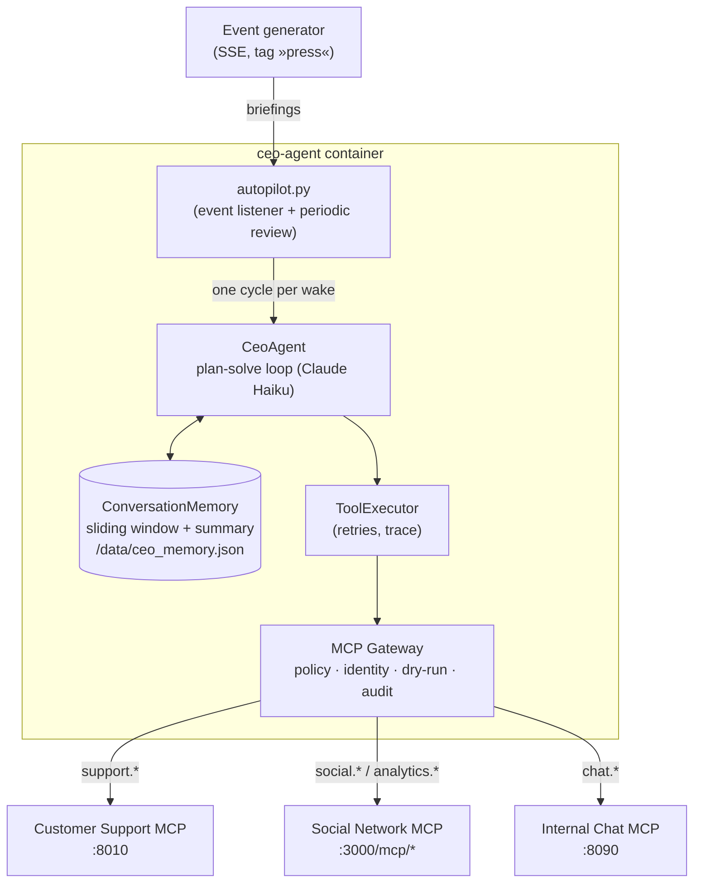
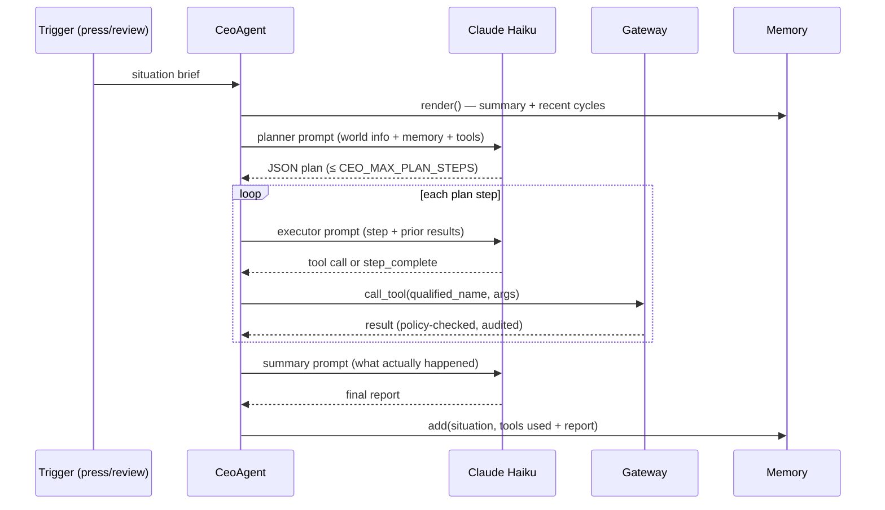
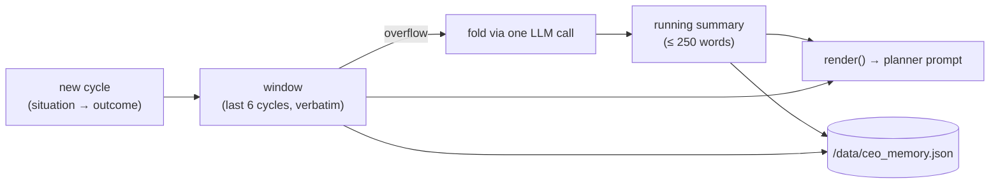

# CEO Agent

The CEO is the central agent of the HappyTuna simulation: an LLM-driven
executive that watches the company's systems, reasons about what is happening,
and acts — responding to support tickets, speaking publicly on the social
network, and coordinating employees over the internal chat. It reaches every
platform **only** through its MCP gateway, which enforces role policy,
identity, and auditing on every call.

Code: [`agents/ceo/`](../agents/ceo/) · Gateway details: [`agents/ceo/README.md`](../agents/ceo/README.md)

## Architecture



The gateway connects to **all the platforms**: the customer-support queue
(`support.*`), the public social network and its analytics surface
(`social.*`, `analytics.*`), and the internal chat (`chat.*`). The journalism
site has no MCP server by design — the CEO experiences the press the way a
real CEO does, through the press briefings it receives and the public
reaction it can measure.

## What wakes the CEO

| Trigger | Source | Behavior |
|---|---|---|
| Press briefing | event generator, tag `press` | Bursts are debounced (`CEO_EVENT_DEBOUNCE`, default 20s) into **one** cycle so a scripted replay doesn't fan out into a dozen full runs |
| Periodic review | timer (`CEO_REVIEW_INTERVAL`, default 900s, `0` = off) | The CEO checks the support queue, analytics and chat even when no news broke |

Cycles never overlap — a periodic review that fires mid-cycle is skipped.

## One cycle (plan–solve)



The executor trace — not the model's claims — is what gets checked and
remembered: a step only counts as done when its tool call really returned OK.

## Memory

The user-visible behavior: the CEO **remembers previous cycles** — it follows
up on its own decisions instead of rediscovering the crisis every time.

Implementation (`agents/ceo/services/memory.py`):



- The last `window_size` (6) cycles are kept verbatim; older ones are folded
  into one bounded running summary (a single LLM call per eviction, and the
  only LLM usage in the module).
- State persists to `/data/ceo_memory.json` (a compose volume), so a restarted
  container resumes with its memory intact.
- If a summarize call fails, the evicted entries are kept verbatim instead —
  memory degrades to "longer", never to "lost".

## Guardrails that keep the study honest

Enforced by the gateway (see [`agents/ceo/roles.yaml`](../agents/ceo/roles.yaml)):

- The CEO **cannot create support tickets** (that would fabricate the public
  it is judged on) — it can read the queue and respond (`patch_ticket`).
- It **cannot touch the analytics controls** (`run_analysis`,
  `set_ai_analysis`) — those alter the instruments that measure it.
- It **cannot re-login** as someone else; identity is bound once per session
  by the connection layer (`CEO_HappyTuna` on social, `CEO-1` on chat).
- `CEO_DRY_RUN=true` holds back **every write** while reads still execute —
  a full observation run with zero side effects.

## Running it

In the full stack it's just another service:

```bash
docker compose up --build ceo-agent
# then fire the scripted crisis feed:
curl -X POST http://localhost:8006/replay?delay=2.0
docker compose logs -f ceo-agent
```

Host-run one-shot behavioral test (needs the platforms up):

```bash
cd agents/ceo
pip install -r requirements.txt
python main.py          # sets GATEWAY_URL_PROFILE=local automatically
```

Configuration knobs are listed in [`.env.example`](../.env.example) (CEO
section) and in `autopilot.py`'s docstring.
